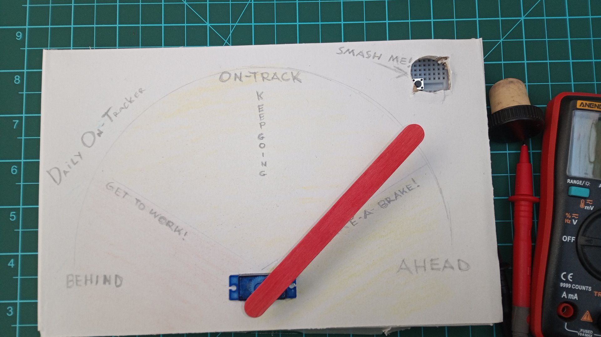
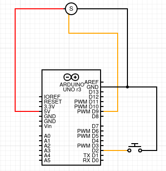
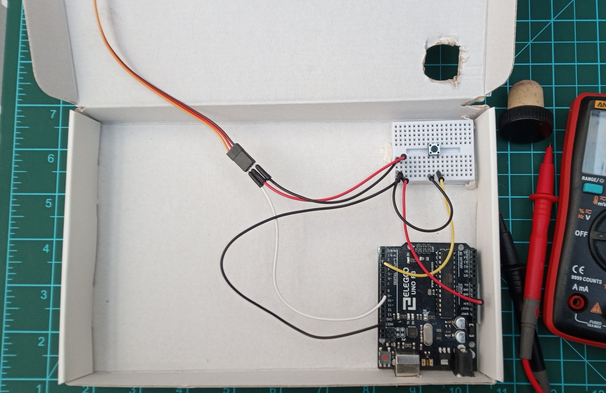

# D.O.T - Daily On Tracker, 24h hackathon-style project using Arduino as a platform

## Synopsis:

During my adventure with IBM Skillsbuild platform in april 2023, I found a need for tool to help me manage workload.
This tool had to meet following requirements:
- Non-ephemeral, and by extension non-virtual
- Tracking progression of **one** activity
- Habit building
- Helping staying motivated
- Simplified, but highly customisable
- Cheap and cheerful
- Quick to implement PoC
- Have capacity to develop further/change platform 

Starting with those requirements, I narrowed my design concept to following:

- Always-on physical device 
- Visualising effort rather than time
- Ongoing tracking until project is completed
- Upcycling "treasures" from my daughter's art and craft chest - added bonus, kids are more likely to participate
in any project that use "their" stuff, rather than "grown-ups" stuff.

## Problem:

Let's assume we take a part in an ongoing or lengthy project. This project has start and end. It starts with, well, nothing done yet; and finishes when the project is done or never.
Since the project is ongoing/lengthy we must divide it into "chunks" or modules to be able to put consistent effort on a daily basis.

Let's call such project **Drinking 8 glasses of water a day** because staying hydrated, apparently, is important. That's 8 modules in 24 hours, or 1 module in 3 hours. 
Setting up alarm every 3 hours would work for some, but being woken up at 4am just to have a glass of water sounds a little bit excessive.
One could say "Just drink a glass every 2 hours to accommodate for 8 hour sleep", but what if you are so obsessed with activity of any kind other then drinking water or just can't drink right now, and simply decide to skip a glass and drink 2 glasses later. What if your memory resemble a sieve, you lost track of time and 8 hours later you start wondering if you even had a single glass today? We definitely don't want to operate without water for more then 24 hours, but drinking a glass every 2 hours may sometimes be unachievable.

## Solution:

In above example, given finite and describable buffer of time (24 hour scope), we don't care if we drink water regularly, as long as we drink 8 glasses of water in that scope of time, we will be fine. We established that 1 glass of water = 3 hours of time and thus we could describe a solution to our drinking problem as a following logic:

```
bool glassEmpty = false; 
int time = 24;
while (time >= 0) {
    sleep(3600);
    time--;
    if (glassEmpty) {
        time = time + 3;
        glassEmpty = !glassEmpty;
    }
    printf("%d\n", time);
}
printf("You suck at drinking water!\n");
```

All we need is to empty the glass without getting outside of our time scope. Job well done.
This solution can be applied to track any kind of activity ie. reading, writing, learning, exercising, brushing teeth etc. as long as it is dividable into modules. 
Furthermore, with small modification you could even track progress of collecting money for holiday trip!

## Implementation:

- **Hardware:**

Since we decided we want to not only track progression of our project, but also staying motivated and feel proud about effort we put in, constant visualisation was imperative. Due to cost and time restriction, advanced methods of indication where out of scope, and I settled on fuel gauge design simulated by small RC servo with painted-red, flat ice lolly stick, attached to the servo arm. This primitive gauge was than pushed through small empty box that once held cov-19 tests. 
It looked rather sad, so I decided to cut same size paper card, draw a dial with pencil and cut a hole for the button.



Inside, position Arduino and fix it with a tack, if you have a small breadboard use it to hold switch and tack it in non-interfering position directly underneath button hole, connect everything according to following diagram:



This completes our manual work. You should end up with something like this:


    
> **Bill of Materials:**
>- Small flat cardboard box (use whatever would be put into bin)
>- Short wine cork (I used port cork)
>- Indicator arm (flat ice lolly stick, or cut one from thick card)
>- Printed or drawn/painted card with dial (to stick on front facing side of our D.O.T)
>- White/blue tack
>- Arduino Uno R3
>- Tactile switch (spst/dpst)
>- Small RC Servo
>- Wires to connect electronics together
>- Small breadboard (optional)


- **Code:**

Well commented code is available here: [D.O.T - code](./dot-code.ino), you will also need Arduino IDE.

## Result:

Mechanism of action is very similar to fuel gauge. Every hour indicator arm is shifting toward "You are running out of time", pressurising you to make an effort and complete planned activity, only after completing an activity you are allowed to "smash that button", adding time to continuously decreasing time window. 
Overall, from ideation to first tests of the D.O.T took 12 hours with further 12 hours of overnight tests (which failed miserably because assigning result of operation on non type-cast numeral literals is a bad idea).


Working D.O.T with tick set to 2 seconds, during normal operation that would be one hour: 

https://github.com/stshellletsski/D.O.T/assets/118393661/6b4ef643-2908-4dec-8d80-2eae240ed73a

### Notes:

D.O.T was (and still is) a smashing success, allowing me to contribute consistent effort even on days when I did not "feel like it". Although due to pushing instead of pulling work and having very high expectations, I was often "in the red". Looking back, I would set it up for less modules/week to feel more rewarded.

### Future development:

As resources will permit, I plan to change platform, add wi-fi connectivity, develop native/web app to simplify configuration and log progression.